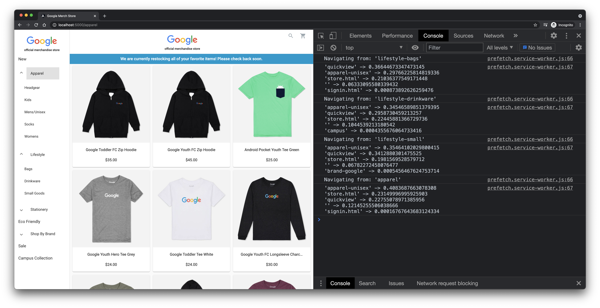

# Angular Predictive Prefetching

This examples shows a sample implementation of predictive prefetching with TensorFlow.js and Angular. You can find more information about how the entire end-to-end solution works in the blog post "[Speed-up your sites with web-page prefetching using Machine Learning](https://blog.tensorflow.org/2021/05/optimize-your-website-with-machine-learning.html)."

*The demo is inspired by the Google Merchandise Store, but does not share any data nor implementation details with it.*

## Setup

To try the example yourself, go through the following steps:

* Install the dependencies of the client and the server:

```shell
cd client && yarn
cd ../server && yarn
```

* Start the server. In a terminal window run:

```shell
cd server && yarn start
```

* Start the client. In a terminal window run:

```shell
cd client && yarn build
cd dist/merch-store
npx serve -s .
```

When you open the browser (by default http://localhost:5000) and navigate through the application in Chrome DevTools you should see logs similar to:

<p align="center">
  
</p>

You can track the activity in the "Network" panel to find the requests the service worker makes based on the predictions:

<p align="center">
  
</p>

## License

MIT
