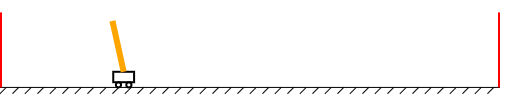

# TensorFlow.js Example: Reinforcement Learning with Cart-Pole Simulation



[See this example live!](https://storage.googleapis.com/tfjs-examples/cart-pole/dist/index.html)

## Overview

This example illustrates how to use TensorFlow.js to perform simple
reinforcement learning (RL). Specifically, it showcases an implementation
of the policy-gradient method in TensorFlow.js with a combination of the Layers
and gradients API. This implementation is used to solve the classic cart-pole
control problem, which was originally proposed in:

- Barto, Sutton, and Anderson, "Neuronlike Adaptive Elements That Can Solve
  Difficult Learning Control Problems," IEEE Trans. Syst., Man, Cybern.,
  Vol. SMC-13, pp. 834--846, Sept.--Oct. 1983
- Sutton, "Temporal Aspects of Credit Assignment in Reinforcement Learning",
  Ph.D. Dissertation, Department of Computer and Information Science,
  University of Massachusetts, Amherst, 1984.

It later became one of OpenAI's gym environmnets:
  https://github.com/openai/gym/blob/master/gym/envs/classic_control/cartpole.py

The gist of the RL algorithm in this example (see [index.js](../index.js)) is:

1. Define a policy network to make decisions on leftward vs. rightward force
   given the observed state of the system. The decision is not completely
   deterministic. Instead, it is a probability that is converted to the actual
   action by drawing random samples from binomial probability distribution.
2. For each "game", calculate reward values in such a way that longer-lasting
   games are assigned positive reward values, while shorter-lasting ones
   are assigned negative reward values.
3. Calculate the gradients of the policy network's weights with respect to the
   actual actions and scale the gradients with the reward values from step 2.
   The scale gradients are added to the policy network's weights, the effect of
   which is to make the policy network more likely to select actions that lead
   to the longer-lasting games given the same system states.

For a more detailed overview of policy gradient methods, see:
  http://www.scholarpedia.org/article/Policy_gradient_methods

For a more graphical illustration of the cart-pole problem, see:
  http://gym.openai.com/envs/CartPole-v1/

### Features:

- Allows user to specify the architecture of the policy network, in particular,
  the number of the neural networks's layers and their sizes (# of units).
- Allows training of the policy network in the browser, optionally with
  simultaneous visualization of the cart-pole system.
- Allows testing in the browser, with visualization.
- Allows saving the policy network to the browser's IndexedDB. The saved policy
  network can later be loaded back for testing and/or further training.

## Usage

```sh
yarn && yarn watch
```
