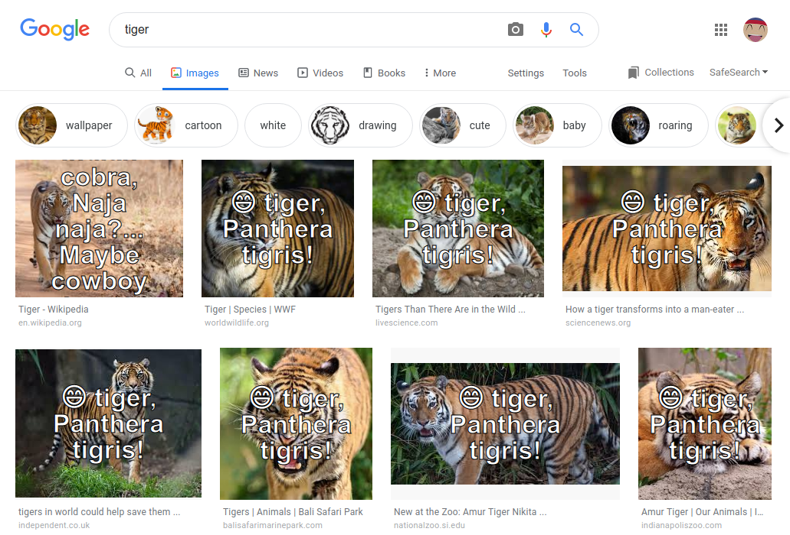

# TensorFlow.js Deployment Example : Browser Extension

This example creates a Chrome extension, enabling users to right-click on images
within a web page, and perform multi-class object detection on them. The
extension will will apply a MobileNetV2 classifier to the image, and then print
the predicted class on top of the image.

To build the extension, use the command:

```sh
yarn
yarn build
```

To install the unpacked extension in chrome, follow the [instructions here](https://developer.chrome.com/extensions/getstarted).  Briefly, navigate to `chrome://extensions`, make sure that the `Developer mode` switch is turned on in the upper right, and click `Load Unpacked`.  Then select the appropriate directory (the `dist` directory containing `manifest.json`);

If it worked you should see an icon for the `TF.js mobilenet` Chrome extension.


Using the extension
----
Once the extension is installed, you should be able to classify images in the browser.  To do so, navigate to a site with images on it, such as the Google image search page for the term "tiger" used here.  Then right click on the image you wish to classify.  You should see a menu option for `Classify image with TensorFlow.js`.  Clicking that image should cause the extension to execute the model on the image, and then add some text over the image indicating the prediction.




Removing the extension
----
To remove the extension, click `Remove` on the extension page, or use the `Remove from Chrome...` menu option when right clicking the icon.
