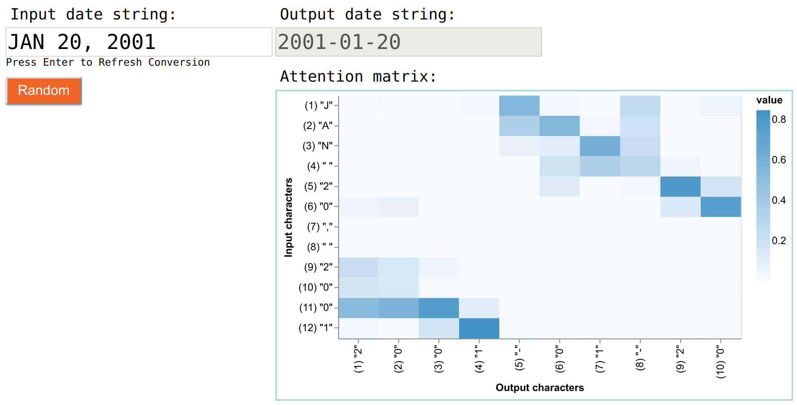

# TensorFlow.js Example: Date Conversion Through an LSTM-Attention Model

[See this example live!](https://storage.googleapis.com/tfjs-examples/date-conversion-attention/dist/index.html)

## Overview

This example shows how to use TensorFlow.js to train a model based on
long short-term memory (LSTM) and the attention mechanism to achieve
a task of converting various commonly seen date formats (e.g., 01/18/2019,
18JAN2019, 18-01-2019) to the ISO date format (i.e., 2019-01-18).

We demonstrate the full machine-learning workflow, consisting of
data engineering, server-side model training, client-side inference,
model visualization, and unit testing in this example.

The training data is synthesized programmatically.

## Model training in Node.js

For efficiency, the training of the model happens outside the browser
in Node.js, using tfjs-node or tfjs-node-gpu.

To run the training job, do

```sh
yarn
yarn train
```

By default, the training uses tfjs-node, which runs on the CPU.
If you have a CUDA-enabled GPU and have the CUDA and CuDNN libraries
set up properly on your system, you can run the training on the GPU
by:

```sh
yarn
yarn train --gpu
```

## Using the model in the browser

To see the trained model in action in the browser, do:

```sh
yarn
yarn watch
```

### Visualization of the attention mechanism

In the page opened by the `yarn watch` command, you can generate
random input date strings by clicking the "Random" button. A converted
date string will appear in the output text box each time a new input
date string is entered. You may also manually enter a date in the input-date
box. But make sure that the date falls into a range between the years 1950
and 2050, as this is the range of dates that the model is trained on.
See [date_format.js](./date_format.js) for more details.

In addition to converting the date and showing the output, the page visualizes
the attention matrix used by the trained model to convert the input date string
to the output one in (e.g., see the image below).



Each column of the attention matrix corresponds to a character in the input
string and each column corresponds to a character in the output string.
A darker color in a cell of the attention matrix
indicates a greater attention paid by the model to the corresponding input
character when generating the corresponding output character.

## Running unit tests

The data and model code in this example are covered by unit tests.
To run the unit tests:

```sh
cd ../
yarn
cd date-conversion-attention
yarn
yarn test
```
