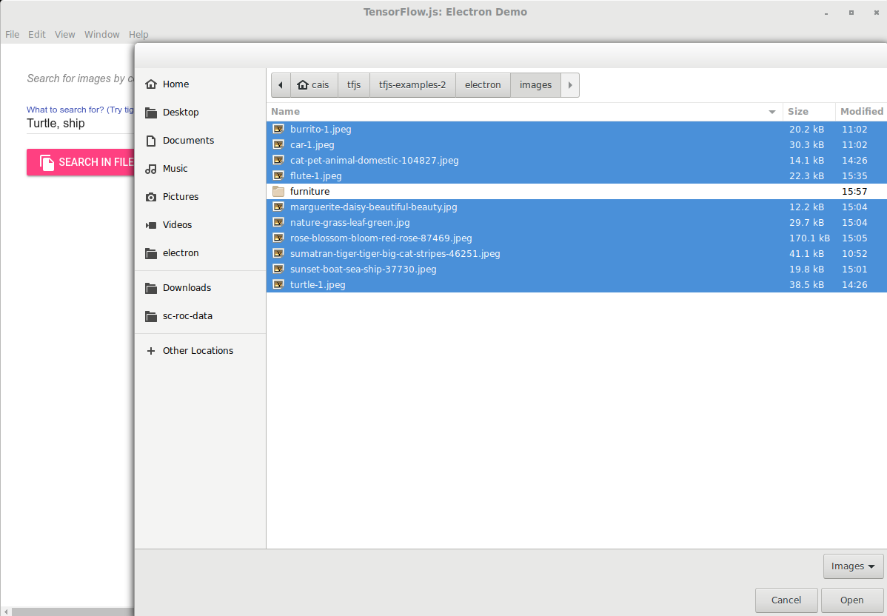
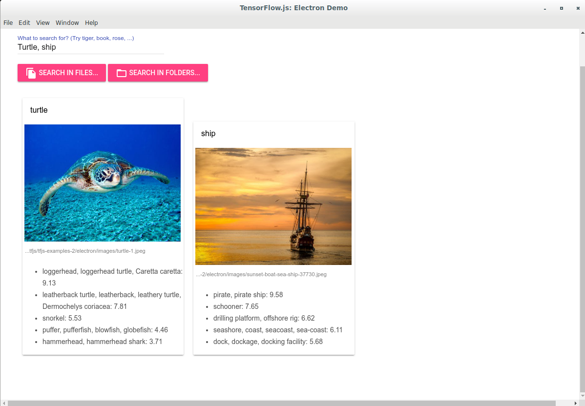

# Deploying TensorFlow.js Models in Electron-based Desktop Apps

This is an example that showcases how to use TensorFlow.js
in cross-platform desktop apps written with
[electron](https://electronjs.org/). In particular, it uses
a MobileNetV2 model running in TensorFlow.js to enable the user
to search for image files on the local filesystem by content
key words (e.g., "daisy", "chair").

## How to use this example

1. Build and launch the app using:

   ```sh
   yarn
   yarn start
   ```

   If you have a CUDA-enabled GPU on your machine and have set up
   the CUDA and CuDNN libraries properly, you can add the `--gpu`
   flag to `yarn start` to use CUDA-accelerate inference, which
   will lead to faster searches.

   ```sh
   yarn
   yarn start --gpu
   ```

2. Specify the words you want to search for in the text field labeled
   "What to search for? ..." You can use one or more search words.
   If there are multiple search words, they should be separated by
   commas.

3. Click one of the "Search in files" and "Search in folders" buttons
   to choose the files or folders you want to search in. The former
   will pop open a dialog in which you can select multiple files, while
   the latter will open a dialog in which you are allowed to select
   multiple folders. See the screenshot below.

  

  If folders are selected, the app will search over
  all image files (with extension names .jpg, .jpeg and .png) in the
  folders recursively.
  This example comes with an image/ folder in which there are about
  a dozen images with various contents such as animals, car, ship
  and furniture.

4. Once files or folders are selected, the app will load the image
   files and search over their contents by applying a convolutional
   neural network (convnet) on them. This may take a few seconds,
   especially if the number of files or folders you are searching over
   is large. In addition The first search action will take longer than
   subsequent ones, due to the need to download the convnet model
   from the Internet.

   The screenshot below shows an example of search results.

  

### Inferernce in the main process vs. in the renderer process

In an Electron desktop app, you can load and run a TensorFlow.js model in
two different ways:

1. In the backend environment of the main process, and/or
2. In the Chromium-based frontend environment of the renderer process.

The code in this example shows how to use models in both ways. The app
loads and runs the model in the backend main process by default. However,
you can check the "Classify images using frontend model" checkbox in the
app's UI to switch to model inference in the frontend renderer process.

Backend inference is usually faster due to the utilization of libtensorflow
(potentially with CUDA acceleration), whereas frontend inferernce
has the advantage of smaller app package size, due to the fact that the
browser JavaScript package of TensorFlow.js is much smaller compared to
libtensorflow.

## Deploying the example as desktop apps

There are several options for packaging and deploying electron-based desktop
apps, including
- [electron-builder](https://www.electron.build/)
- [electron-forge](https://github.com/electron-userland/electron-forge)
- [electron-packager](https://github.com/electron-userland/electron-packager)

This example uses [electron-builder] to package the app as Linux Debian (.deb)
package. To perform the packaging, do:

```sh
yarn
yarn electron-builder
```

The resulting .deb package will be generated in the dist/ directory.
The following fields in the [package.json](./package.json) file are required
by the build process of electron-builder:
- name
- description
- author.name
- author.email
- license
- repository
- build

For official guidance and info on platforms other than linux (e.g., MacOS and
Windows), see
[Electron Documentation](https://electronjs.org/docs/tutorial/application-distribution).

## Origin of images

All images used for demonstration purpose (in the image/) folder
are free-license images from https://pexels.com.