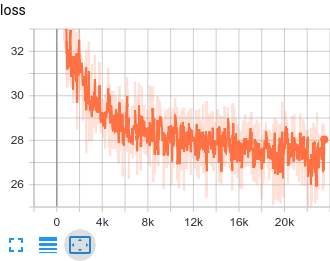
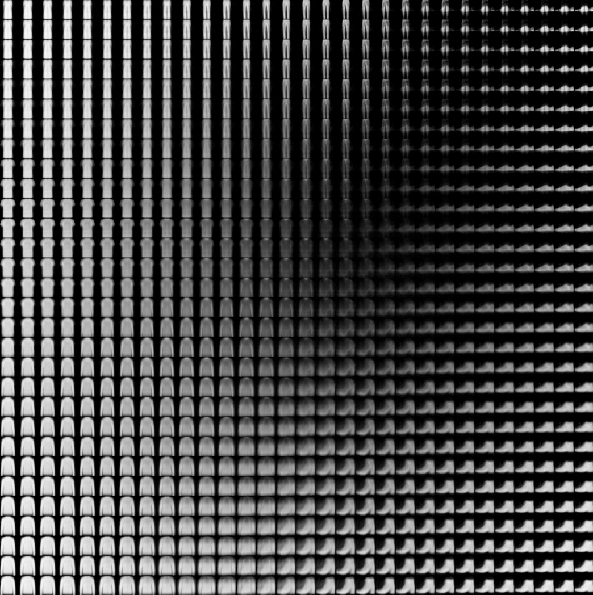

# TensorFlow.js: Training a variational autoencoder.

This example shows you how to train a [variational autoenconder](https://blog.keras.io/building-autoencoders-in-keras.html) using TensorFlow.js on Node.

The model will be trained on the [Fashion MNIST](https://github.com/zalandoresearch/fashion-mnist) dataset.

This example is a port of the code for a multilayer perceptron based variational
autoencoder from this link https://github.com/keras-team/keras/blob/master/examples/variational_autoencoder.py See [this tutorial](https://blog.keras.io/building-autoencoders-in-keras.html) for a description of how autoencoders work.

## Prepare the node environment:
```sh
yarn
# Or
npm install
```

In the instructions below you can replace ```yarn``` with ```npm run``` if you do not have yarn installed.

## Download the data

You can run ```yarn download-data``` or follow the instructions below t download it manually.

Download the [train-images-idx3-ubyte.gz](http://fashion-mnist.s3-website.eu-central-1.amazonaws.com/train-images-idx3-ubyte.gz) from [this page](https://github.com/zalandoresearch/fashion-mnist#get-the-data).

Uncompress the file and put the resulting `train-images-idx3-ubyte`. Into a folder called `dataset` within this example folder.

## Run the training script:
```sh
yarn train
```

or if you have CUDA installed you can use

```sh
yarn train --gpu
```

It will display a preview image after every epoch and will save the model at the end of training. At the end of each epoch the preview image should look more and more like an item of clothing. The way the loss function is written the loss at the end of a good training run will be in the 40-50 range (as opposed to more typical case of being close to zero).

If you are running on a Linux system that is [CUDA compatible](https://www.tensorflow.org/install/install_linux), try using the GPU
package. To do so, replace `require('@tensorflow/tfjs-node')` with `require('@tensorflow/tfjs-node-gpu');` in
[train.js](./train.js).

### Monitoring model training with TensorBoard

By using the `--logDir` flag of the `yarn train` command, you can log the
batch-by-batch loss values to a log directory, so that it can be monitored
using [TensorBoard](https://www.tensorflow.org/guide/summaries_and_tensorboard).

For example:

```sh
yarn train --logDir /tmp/vae_logs
```

Start TensorBoard  in a separate terminal:

```sh
pip install tensorboard  # Unless you've already installed tensorboard.


tensorboard --logdir /tmp/vae_logs
```

Once started, the tensorboard process will print an http:// URL to the
console. You can open it in the browser and see the loss curve, e.g, see
the example below.



## Serve the model and view the results

Once the training is complete run

```sh
yarn watch
```

to serve the model and the web page that goes with it.


