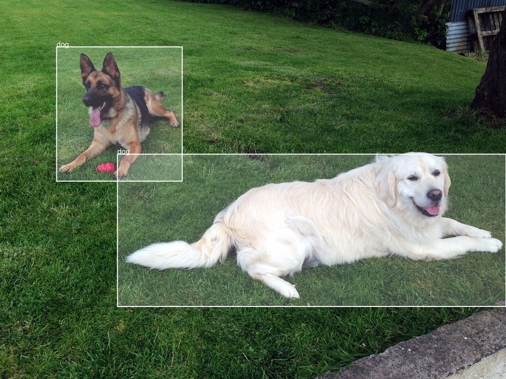

# TensorFlow.js Example: Running a TensorFlow SavedModel in Node.js

You can find a live demo of this example at https://us-central1-tfjs-node-savedmodel.cloudfunctions.net/app. (It may take several seconds to upload the image based on your internet connection).

This demo demonstrates how to run a TensorFlow SavedModel in Node.js natively without using [tfjs-converter](https://github.com/tensorflow/tfjs/tree/master/tfjs-converter) to convert the model. Native execution of TensorFlow SavedModel in Node.js supports more ops and better performance compared with converted model.

This example runs a object detection model in Node.js, and hosts the model through Firebase Cloud Functions. Before getting started, please finish first three steps of the [firebase Guide](https://firebase.google.com/docs/functions/get-started) to ensure the machine has required setup. For more information about Tensorflow object detection API, check out this readme in [tensorflow/object_detection](https://github.com/tensorflow/models/blob/master/research/object_detection/README.md).


To launch the demo, do the following steps:

1. Go to file `.firebaserc` and update `projects.default` with your own firebase project name.
2. Run the following commands:

```sh
cd functions
npm install
firebase serve
```
3. Open the website displayed in the log

It will take several seconds to load and warm up the model. Once the page is loaded, you can upload an JPEG image and test. Following is an example output:



By default, the inference uses tfjs-node, which runs on the CPU.
If you have a CUDA-enabled GPU and have the CUDA and CuDNN libraries
set up properly on your system, you can run the inference on the GPU
by replacing the tfjs-node package with tfjs-node-gpu in the `package.json` file and `functions/index.js` file.

Please note: Firebase only support node version 8.
