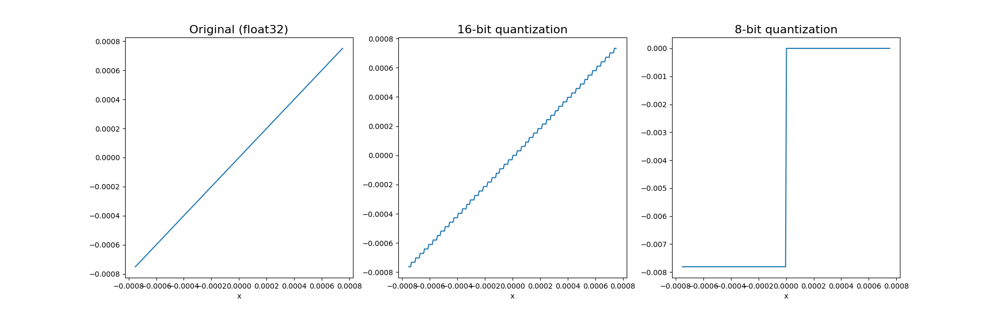

# TensorFlow.js Example: Effects of Post-Training Weight Quantization

Post-training quantization is a model-size reducing technique useful for
deploying model on the web and in storage-limited environments such as
mobile devices. TensorFlow.js's
[converter module](https://github.com/tensorflow/tfjs-converter)
supports reducing the numeric precision of weights to 16-bit and 8-bit
integers after the completion of the model training, which leads to
approximately 50% and 75% reduction in model size, respectively.

The following figure provides an intuitive understanding of the degree
to which weight values are discretized under the 16- and 8-bit quantization
regimes. The figure is based on a zoomed-in view of a sinusoidal wave.



This example focuses on how such quantization of weights affect the
model's predicton accuracy.

## What's in this demo

This demo on quantization consists of four examples:
1. housing: this demo evaluates the effect of quantization on the accuracy
   of a multi-layer perceptron regression model.
2. mnist: this demo evaluates the effect of quantization on the accuracy
   of a relatively small deep convnet trained on the MNIST handwritten digits
   dataset. Without quantization, the convnet can achieve close-to-perfect
   (i.e., ~99.5%) test accuracy.
3. fashion-mnist: this demo evaluates the effect of quantization on the
   accuracy of another small deep convnet traind on a problem slightly harder
   than MNIST. In particular, it is based on the Fashion MNIST dataset. The
   original, non-quantized model has an accuracy of 92%-93%.
4. MobileNetV2: this demo evaluates quantized and non-quantizd versions of
   MobeilNetV2 (width = 1.0) on a sample of 1000 images from the
   [ImageNet](http://www.image-net.org/) dataset. This subset is based on the
   sampling done by https://github.com/ajschumacher/imagen.

In the first three demos, quantizing the weights to 16 or 8 bits does not
have any significant effect on the accuracy. In the MobileNetV2 demo, however,
quantizing the weights to 8 bits leads to a significant deterioration in
accuracy, as measured by the top-1 and top-5 accuracies. See example results
in the table below:

| Dataset and Model      | Original (no-quantization) | 16-bit quantization | 8-bit quantization |
| ---------------------- | -------------------------- | ------------------- | ------------------ |
| housing: multi-layer regressor  |  MAE=0.311984     | MAE=0.311983        | MAE=0.312780       |
| MNIST: convnet         | accuracy=0.9952            | accuracy=0.9952     | accuracy=0.9952    |
| Fashion MNIST: convnet | accuracy=0.922             | accuracy=0.922      | accuracy=0.9211    |
| MobileNetV2            | top-1 accuracy=0.618; top-5 accuracy=0.788 | top-1 accuracy=0.624; top-5 accuracy=0.789 | top-1 accuracy=0.280; top-5 accuracy=0.490 |

MAE Stands for mean absolute error (lower is better).

They demonstrate different effects of the same quantization technique
on different problems.

### Effect of quantization on gzip compression ratio

An additional factor affecting the over-the-wire size of models
under quantization is the gzip ratio. This factor should be taken into
account because gzip is widely used to transmit large files over the
web.

Most non-quantized models (i.e.,
models with 32-bit float weights) are not very compressible, due to
the noise-like variation in their weight parameters, which contain
few repeating patterns. The same is true for models with weights
quantized at the 16-bit precision. However, when models are quantized
at the 8-bit precision, there is usually a significant increase in the
gzip compression ratio. The `yarn quantize-and-evalute*` commands in
this example (see sections below) not only evaluates accuracy, but also
calculates the gzip compression ratio of model files under different
levels of quantization. The table below summarizes the compression ratios
from the four models covered by this example (higher is better):

gzip compression ratio:
`(total size of the model.json and weight files) / (size of gzipped tar ball)`

| Model      | Original (no-quantization) | 16-bit quantization | 8-bit quantization |
| ---------- | -------------------------- | ------------------- | ------------------ |
| housing: multi-layer regressor  | 1.121 | 1.161               | 1.388              |
| MNIST: convnet         | 1.082          | 1.037               | 1.184              |
| Fashion MNIST: convnet | 1.078          | 1.048               | 1.229              |
| MobileNetV2            | 1.085          | 1.063               | 1.271              |

## Running the housing quantization demo

In preparation, do:

```sh
yarn
```

To run the train and save the model from scratch, do:
```sh
yarn train-housing
```

If you are running on a Linux system that is [CUDA compatible](https://www.tensorflow.org/install/install_linux), try installing the GPU:

```sh
yarn train-housing --gpu
```

To perform quantization on the model saved in the `yarn train` step
and evaluate the effects on the model's test accuracy, do:

```
yarn quantize-and-evaluate-housing
```

## Running the MNIST quantization demo

In preparation, do:

```sh
yarn
```

To run the train and save the model from scratch, do:
```sh
yarn train-mnist
```

or with CUDA acceleration:

```sh
yarn train-mnist --gpu
```

To perform quantization on the model saved in the `yarn train` step
and evaluate the effects on the model's test accuracy, do:

```
yarn quantize-and-evaluate-mnist
```

The command also calculates the ratio of gzip compression for the
model's saved artifacts under the three different levels of quantization
(no-quantization, 16-bit, and 8-bit).

## Running the Fashion-MNIST quantization demo

In preparation, do:

```sh
yarn
```

To run the train and save the model from scratch, do:
```sh
yarn train-fashion-mnist
```

or with CUDA acceleration:

```sh
yarn train-fashion-mnist --gpu
```

To perform quantization on the model saved in the `yarn train` step
and evaluate the effects on the model's test accuracy, do:

```
yarn quantize-and-evaluate-fashion-mnist
```

## Running the MobileNetV2 quantization demo

Unlike the previous three demos, the MobileNetV2 demo doesn't involve
a model training step. Instead, the model is loaded as a Keras application
and converted to the TensorFlow.js format for quantization and evaluation.

The non-quantized and quantized versions of MobileNetV2 are evaluated
on a sample of 1000 images from the [ImageNet](http://www.image-net.org/)
dataset. The image files are downloaded from the hosted location on the
web. This subset is based on the sampling done by
https://github.com/ajschumacher/imagen.

All these steps can be performed with a single command:

```sh
yarn quantize-and-evaluate-MobileNetV2
```
