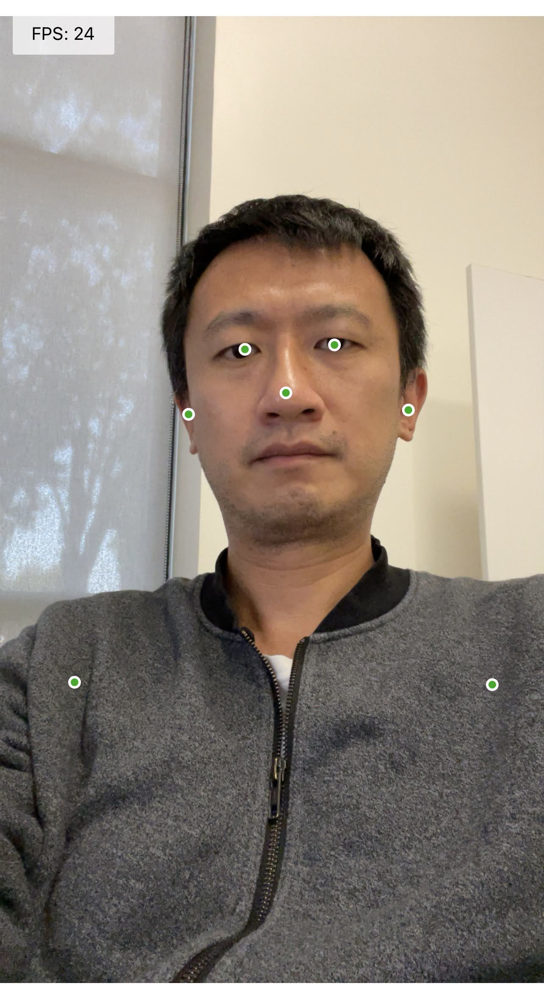

# Overview

A quick demo for running [TFJS Pose Detection][posedetection] model
([MoveNet.SinglePose.Ligntning][tfhub]) using
[TFJS React Native][tfjs-react-native] in an Expo project. Only the keypoints
are rendered in the demo.

To run it locally:

```
$ yarn
$ yarn start
```

Then scan the QR code to open it in the `Expo Go` app.

Tested on Pixel 2, iPhone 12 Pro Max, iPad, and iPad Pro.


[posedetection]: https://github.com/tensorflow/tfjs-models/tree/master/pose-detection
[tfhub]: https://tfhub.dev/google/tfjs-model/movenet/singlepose/lightning/4
[tfjs-react-native]: https://github.com/tensorflow/tfjs/tree/master/tfjs-react-native
[screenshots]: https://photos.app.goo.gl/U972ww4HpaKPK6jEA
