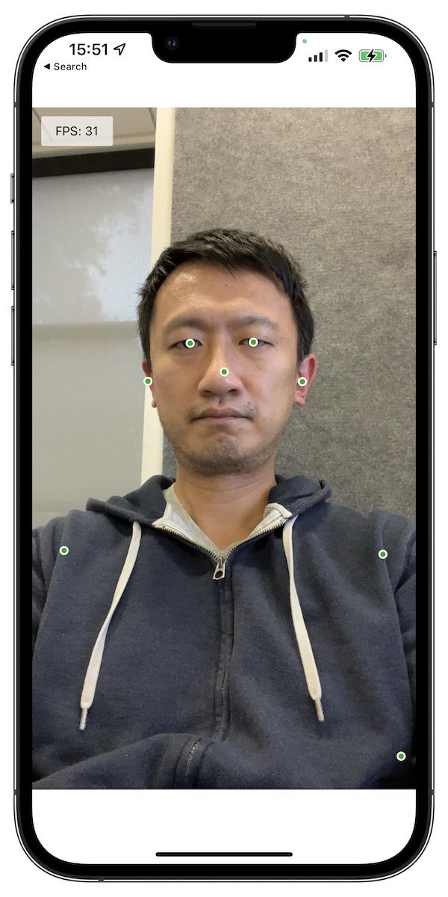
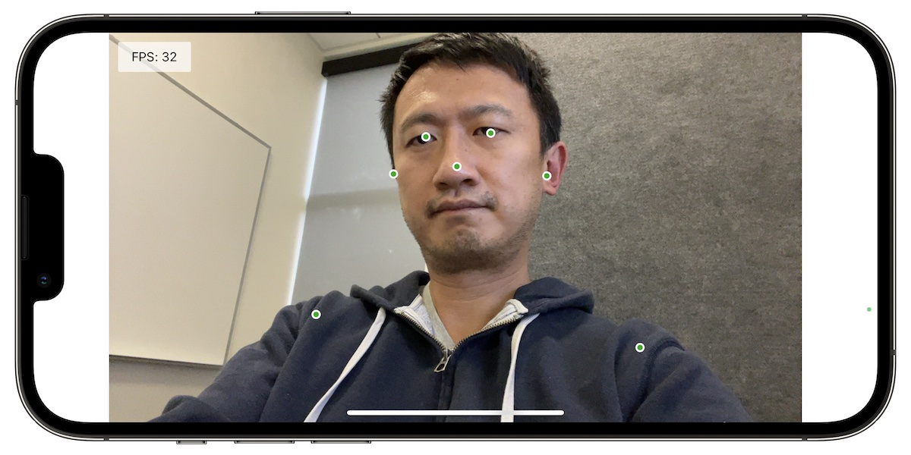

# Overview

A quick demo for running [TFJS Pose Detection][posedetection] model
([MoveNet.SinglePose.Ligntning][tfhub]) using
[TFJS React Native][tfjs-react-native] in an Expo project. It supports both
portrait and landscape mode with front and back camera. Only the keypoints are
rendered in the demo.

To run it locally:

```
$ yarn
$ yarn start
```

Then scan the QR code to open it in the `Expo Go` app.

If the demo app crashes on startup, it is highly likely caused by incompatible
package versions, specifically `expo-gl` and `react-native`. As of Jan 2022,
the following version combination should work. It is tested on iPhone 13 Pro
Max with iOS 15.1.1:

```
"expo": "~44.0.2",
"expo-gl": "^11.1.1",
"expo-gl-cpp": "^11.1.0",
"react": "17.0.1",
"react-native": "~0.64.3",
```




[posedetection]: https://github.com/tensorflow/tfjs-models/tree/master/pose-detection
[tfhub]: https://tfhub.dev/google/tfjs-model/movenet/singlepose/lightning/4
[tfjs-react-native]: https://github.com/tensorflow/tfjs/tree/master/tfjs-react-native
[screenshots]: https://photos.app.goo.gl/U972ww4HpaKPK6jEA
