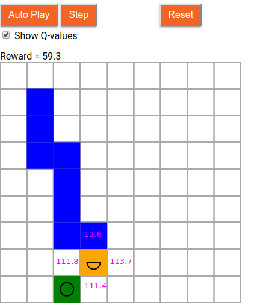

# Using Deep Q-Learning to Solve the Snake Game



[See this example live!](https://storage.googleapis.com/tfjs-examples/snake-dqn/index.html)

Deep Q-Learning is a reinforcement-learning (RL) algorithm. It is used
frequently to solve arcade-style games like the Snake game used in this
example.

## The Snake game

The Snake game is a grid-world action game in which the player controls
a virtual snake that keeps moving on the game board (9x9 by default).
At each step, there are four possible actions: left, right, up, and down.
To achieve higher scores (rewards), the player should guide the snake
to the fruits on the screen and "eat" them, while avoiding
- its head going off the board, and
- its head bumping into its own body.

This example consists of two parts:
1. Training the Deep Q-Network (DQN) in Node.js
2. Live demo in the browser

## Training the Deep Q-Network in Node.js

To train the DQN, use command:

```sh
yarn
yarn train
```

If you have a CUDA-enabled GPU installed on your system, along with all
the required drivers and libraries, append the `--gpu` flag to the command
above to let use the GPU for training, which will lead to a significant
increase in the training speed:

```sh
yarn train --gpu
```

To monitor the training progress using TensorBoard, use the `--logDir` flag
and point it to a log directory,  e.g.,

```sh
yarn train --logDir /tmp/snake_logs
```

During the training, you can use TensorBoard to visualize the curves of
- Cumulative reward values from the games
- Training speed (game frames per second)
- Value of the epsilon from the epsilon-greedy algorithm
and so forth.

Specifically, open a separate terminal. In the terminal, install tensorboard and
launch the backend server of tensorboard:

```sh
pip install tensorboard
tensorboard --logdir /tmp/snake_logs
```

A detailed TensorBoard training log is hosted and viewable at this
[TensorBoard.dev link](https://tensorboard.dev/experiment/TJFBWBx3T5WrFBs4Ar76Sw/#scalars).

Once started, the tensorboard backend process will print an `http://` URL to the
console. Open your browser and navigate to the URL to see the logged curves.

## Running the demo in the browser

After the DQN training completes, you can use the following command to
launch a demo that shows how the network plays the game in the browser:

```sh
yarn watch
```
